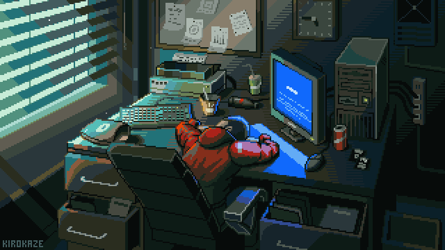
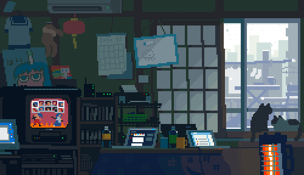

<div align="center">

</div>

<br/>

```text
SAM(1)                    Linux User's Manual                    SAM(1)

NAME
       Saqib Mhaishale - Linux/FOSS lifer, terminal-first, still earning the
       "systems" part of "systems engineer"

SYNOPSIS
       sam [--track cloud-architect]
           [--target netflix|mubi|criterion|hbomax]
           [--INTP]

DESCRIPTION
       Diploma in Computer Engineering, 96.59%, 3rd in department.
       Now reading for a B.Tech via DSE lateral entry at PCCOE,
       IT branch. Interned as an Android developer, shipping real
       features in Java, Flutter, and Supabase/Firebase rather
       than tutorials.

       Spends most waking hours in a terminal, ricing it more
       than is strictly productive. Approaches an unfamiliar
       stack the way a cinephile approaches an unfamiliar
       filmography -- sit with it a while before claiming
       fluency.

       Long-term target: a Platform / Cloud Architect seat
       somewhere that still makes things worth watching --
       Netflix, Mubi, Criterion, HBO Max.

FILES
       ~/CineGraph          Neo4j + FastAPI + React -- knowledge
                             graph of ~30,000 Indian films, 44k+
                             connections, scraped via the TMDB API
       ~/VT-scan             Rust -- parallel CLI hash-scanner
                             against the VirusTotal API
       ~/Image-To-Ascii      Python -- GPU-accelerated image to
                             true-color ASCII TUI
       ~/MyTerminalConfig    PowerShell -- the rice itself, made
                             portable across machines
       ~/Cine-Hub            JavaScript -- a film-browsing web app

ENVIRONMENT
       EDITOR      nvim (NvChad/Lazy) or zed, both hand-configured
       SHELL       bash (zsh, fish, nu kept around for later)
       TERM        WezTerm, theme "Candlelit Library" (see above)
       DISTRO      Fedora / Bazzite this week, ask again next week

INTERESTS
       A decent Cinephile (see my letterboxed),Eastern folk horror,
       Existentialist pondering & Alternate Philosophies, History Buff, Archeology,
       Investigating Rabbit roles and Icebergs, Documentaries, Internet horror,
       Conspiracy Theories, Reading Fiction.

LEARNING
       deeper Linux internals, GCP/AWS/IBM, Tails OS & Qubes OS, Tor & I2P protocol
       Cloud certs (in progress), HackTheBox/TryHackMe/pwn.college, BSD
       Archeological and Scientific AI ML as a intersection of my passion and pragmatism.

BUGS
       Prone to switching stacks mid-project at 2am when Rust
       looks more interesting than whatever is actually due.
       So a little bit of adhd, due to my intense curiosity.
       but i am self aware enough to not be ignorant of it.

SEE ALSO
       github.com/Sam97300
       www.linkedin.com/in/saqib-mhaishale-a8626430b
       https://discord.com/users/sam_97300
       https://boxd.it/e8qpf
       https://x.com/Edwin_Jobs
       https://pin.it/3WzcCYXiv

AUTHOR
       Saqib.A.Mhaishale (SAM). Bug reports welcome as GitHub issues.

SAM(1)                          2026                          SAM(1)
```
<div align="center">

</div>

